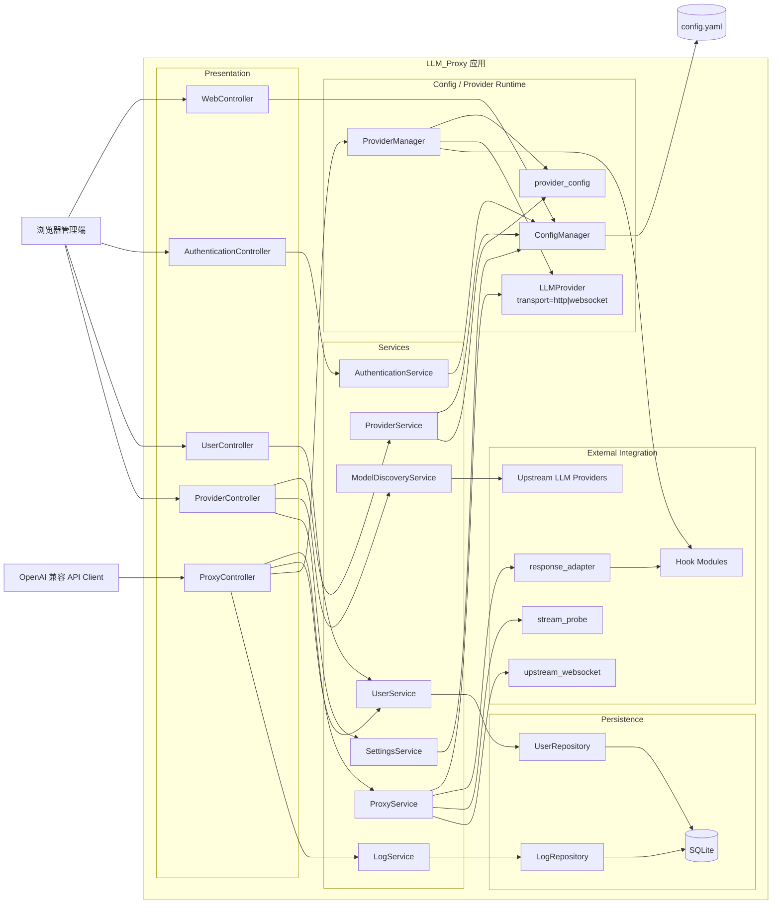
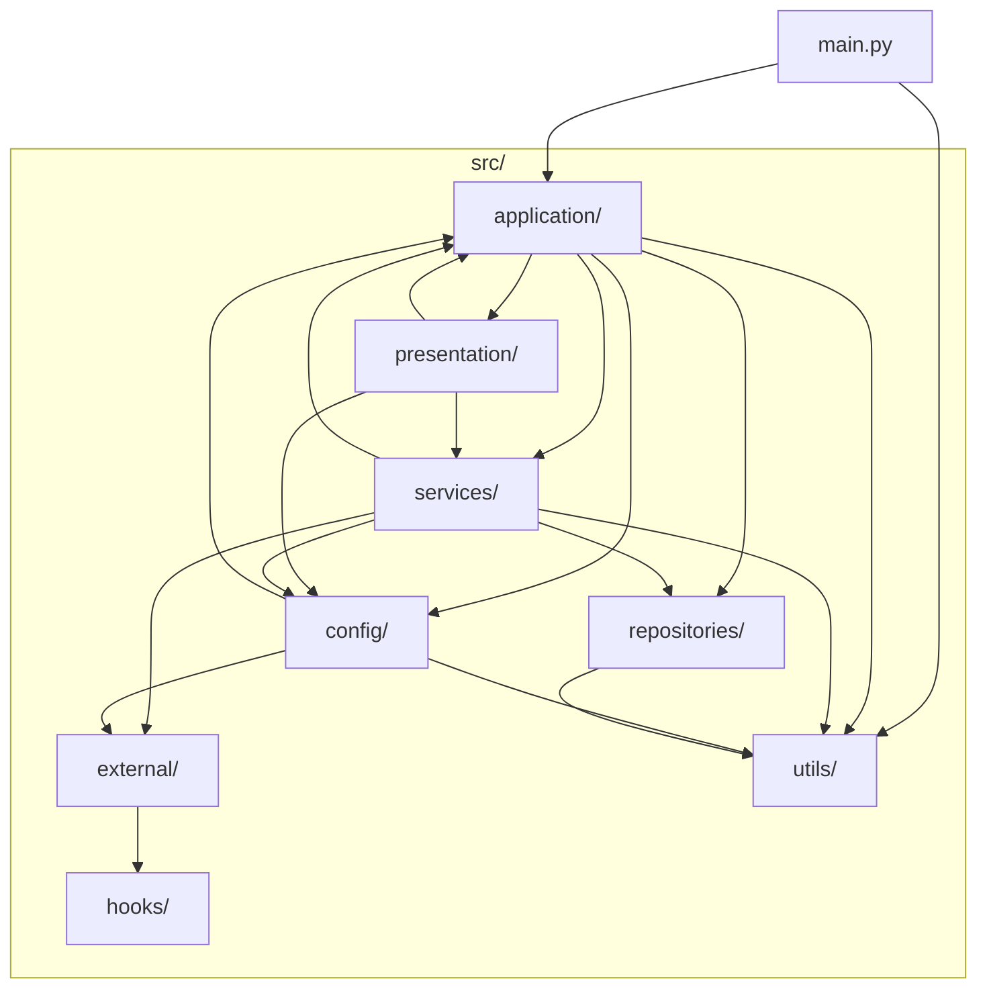
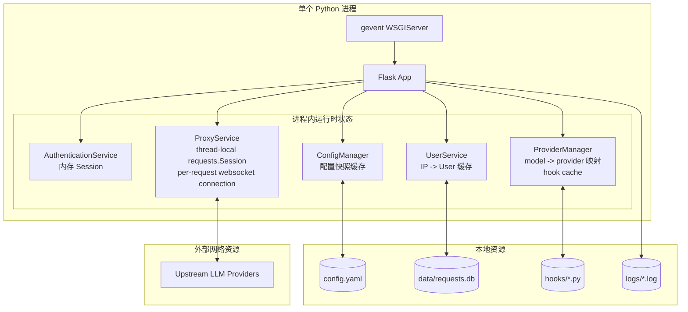
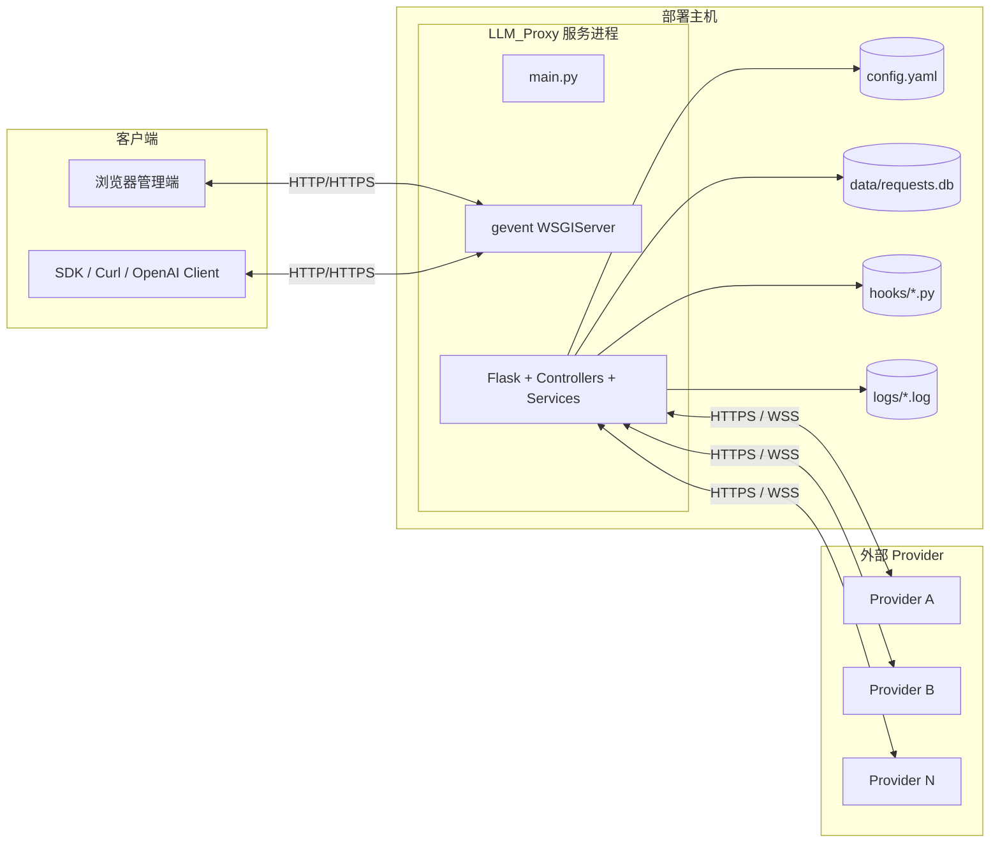
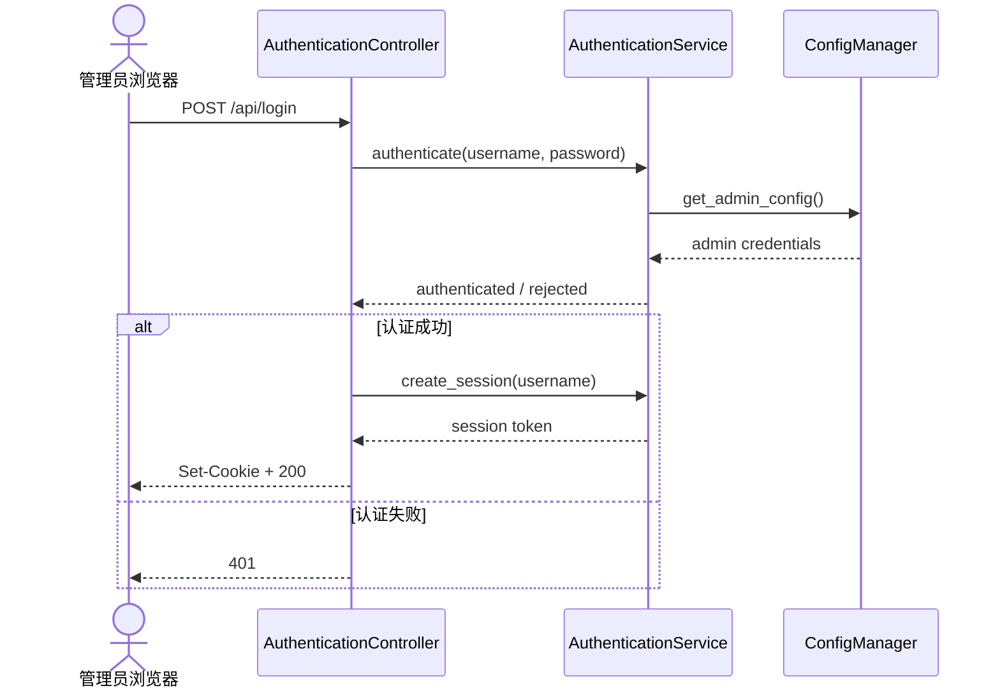
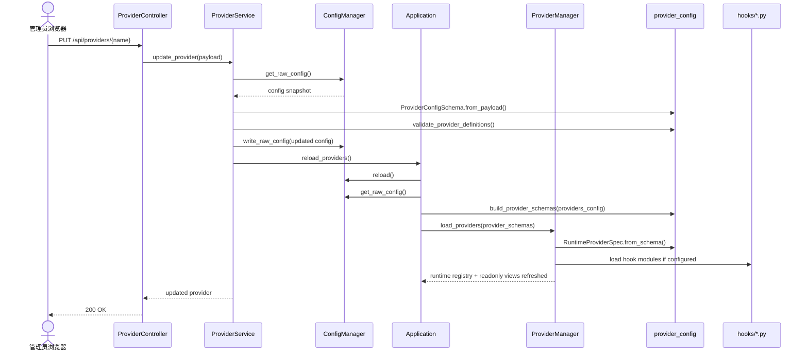
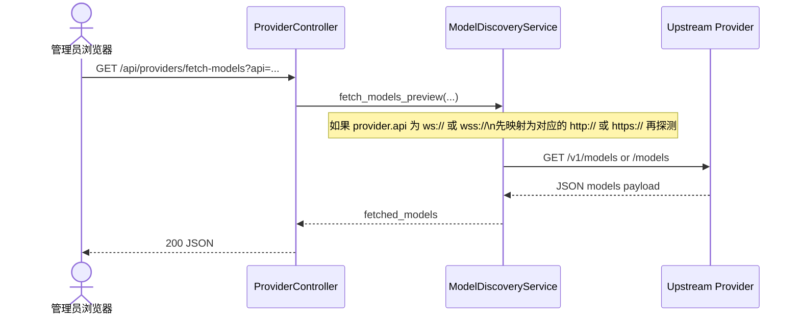
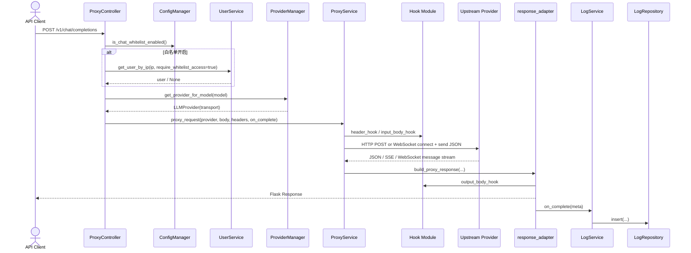
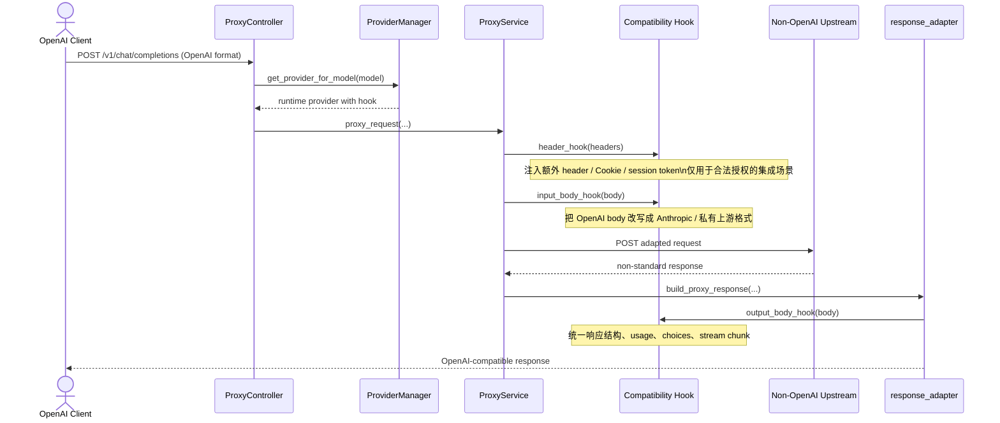

# LLM_Proxy 4+1 Architecture View

本文档描述当前代码实现对应的 4+1 架构视图，作为后续重构、评审和需求变更时的基线。

维护约束：
- 涉及模块职责、依赖关系、主请求链路、运行时状态、配置加载/重载机制、Hook 机制、部署拓扑的修改时，需要同步更新本文件。
- 如果代码实现与本图不一致，以代码为准，但提交中应补齐文档更新。

## 0. Architecture Summary

系统当前是一个单进程、分层式单体应用，按职责分成两条主轴：

- 控制平面：后台管理、认证、用户、Provider 配置、系统设置
- 数据平面：OpenAI 兼容代理、模型路由、上游请求转发、响应适配、日志落库

这个项目当前最有区分度的能力不是“普通 API 代理”，而是：

- 通过 Hook 机制在请求头、请求体、响应体三个阶段做协议适配
- Provider 运行时显式携带 `transport`，把 HTTP/SSE 与 WebSocket 上游统一收敛到同一条代理链路
- 既能接标准 OpenAI 风格上游，也能接非标准协议上游
- 适合处理 Claude / Anthropic 一类需要格式转换的接入场景
- 也适合处理经过授权的会话型集成，例如额外 Cookie、session token、自定义 header 或私有参数

这里强调的是“授权前提下的兼容与适配”，不是绕过访问控制。

关键代码位置：

- 启动与装配：[main.py](../main.py)
- 组合根：[application.py](../src/application/application.py)
- 配置与 Provider 运行时：[config_manager.py](../src/config/config_manager.py) [provider_manager.py](../src/config/provider_manager.py)
- Hook 协议：[contracts.py](../src/hooks/contracts.py)
- 代理主链路：[proxy_controller.py](../src/presentation/proxy_controller.py) [proxy_service.py](../src/services/proxy_service.py)
- WebSocket 上游桥接：[upstream_websocket.py](../src/external/upstream_websocket.py)

## 1. Logical View

逻辑划分：

- `Presentation` 负责 HTTP 路由、鉴权入口、页面渲染和请求/响应封装
- `Services` 负责用例编排，不直接共享全局可变配置
- `Config / Provider Runtime` 负责 YAML 配置快照、显式 `ProviderConfigSchema` / `RuntimeProviderSpec` 工厂、只读运行时视图、模型到 Provider 的运行时映射，以及 provider 传输类型解析
- `Persistence` 负责 SQLite 读写
- `External Integration` 负责上游协议适配、流式探测、WebSocket 消息桥接、Hook 扩展和上游 Provider 集成

其中最重要的扩展边界是 Hook：

- `header_hook`
- `input_body_hook`
- `output_body_hook`

它使系统从“静态代理”升级成“可编排协议适配器”。

## 2. Development View

开发视图解读：

- `application` 是组合根，不承载具体业务规则
- `presentation -> services` 是主要调用方向
- `services -> repositories/config/external` 是业务侧依赖方向
- `config` 更像运行时配置和 Provider 注册子系统
- `hooks` 是面向定制集成的外部扩展点

## 3. Process View

进程视图要点：

- 当前是单进程单实例内存态设计
- `AuthenticationService` 的 Session 存在进程内存中，重启后失效
- `UserService` 有 IP 维度缓存
- `ProviderManager` 持有运行时模型路由表、只读 `ProviderRuntimeView` 注册表和 Hook 缓存
- `ProxyService` 维护 thread-local `requests.Session`，并在需要时建立短生命周期 websocket 上游连接
- Hook 模块以运行时动态加载方式参与请求路径
- 如果未来引入多实例部署，这些内存态要重新设计

## 4. Physical View

物理视图要点：

- 当前部署结构很简单，单机即可运行
- 本地状态包括配置文件、SQLite、日志文件、Hook 文件
- 外部依赖主要是上游模型 Provider 的 HTTP API 或 WebSocket API

## 5. Scenario View

### 5.1 管理员登录

### 5.2 Provider 配置变更并自动重载

### 5.3 后台探测上游模型列表

### 5.4 代理一次 `/v1/chat/completions`

### 5.5 非标准上游协议适配

## 6. Current Architectural Assessment

当前架构优点：

- 模块划分清楚，学习成本低
- 单进程单文件配置的运维复杂度很低
- 控制平面和数据平面在职责上已经分离出清晰轮廓
- Hook 扩展点足够轻量，但表达力很强
- 兼容层能力使项目不局限于“标准 API Key 型接入”
- 通过显式 `transport` 与外部桥接层，HTTP/SSE 和 WebSocket 上游不再混杂在同一段响应解析逻辑里

当前架构边界：

- 运行时状态仍集中在单进程内存中，不适合多实例横向扩展
- `presentation` 层仍承担部分接口协议细节和错误映射责任
- `config` 子系统已经收敛为配置快照、显式 schema/factory、Provider 注册三类职责，但仍集中在同一 package 中
- Hook 动态加载带来了灵活性，也带来了调试、观测和测试复杂性
- 当前 WebSocket 上游连接仍是“按请求建立、按请求关闭”，尚未像 CLIProxyAPI 那样引入长会话复用与增量输入状态机

## 7. Evolution Suggestions

如果后面继续演进，优先建议是：

- 增加官方维护的 Hook 示例库
  - Claude / Anthropic 兼容示例
  - session header / Cookie 注入示例
  - 私有网关适配示例
- 基于 `ProviderRuntimeView` 增加后台运行时诊断或只读观测能力
- 补充 Hook 输入输出转换测试
- 评估是否把 Session、Provider Registry、User IP 缓存从单进程内存态解耦
