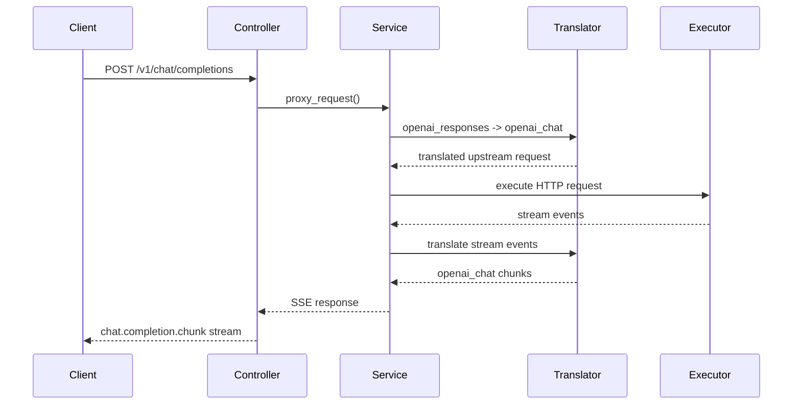
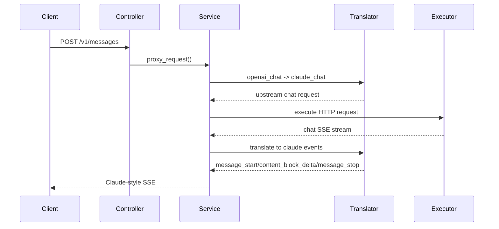

# 4+1 Architecture

## 1. Context

这个项目是一个协议翻译型 LLM Proxy。

它的目标不是“支持所有厂商的所有接口”，而是用一套干净的首版架构，稳定支持：

- 上游协议族
  - `openai_chat`
  - `openai_responses`
  - `claude_chat`
  - `codex`
- 下游协议面
  - `POST /v1/chat/completions`
  - `POST /v1/responses`
  - `POST /v1/messages`
  - `GET /v1/models`

这个版本不保留 Gemini / Antigravity，也不保留旧字段兼容逻辑。

## 2. Logical View

### 2.1 Core Pipeline

系统按下面的统一链路工作：

```text
downstream request
  -> controller
  -> provider lookup
  -> header_hook / request_guard
  -> translator.translate_request()
  -> executor
  -> decoder
  -> translator.translate_response()
  -> response_guard
  -> encoder
  -> downstream response
```

补充：hook 在 retry 场景下还可以读取上一轮失败摘要，用于做轻量级重试决策：

- `last_status_code`
- `last_error_type`

### 2.2 Major Components

- `ProxyController`
  - 校验下游 route 和 `target_format`
  - 构造标准错误体
- `ProviderManager`
  - 加载 provider 配置
  - 维护 `provider/model -> provider` 映射
- `AuthGroupManager`
  - 加载 `auth_groups`
  - 选择 `auth_entry`
  - 持久化冷却、禁用与配额运行态
- `ProxyService`
  - 组装整条代理链路
- `ExecutorRegistry`
  - 负责 HTTP / WebSocket 上游连接
- `Decoder`
  - 将上游流拆成统一事件
- `TranslatorRegistry`
  - 负责 `source_format -> target_format` 协议适配
- `Encoder`
  - 将统一 chunk 编码成下游协议
- `Hook`
  - 只负责 header 和 guard

Hook 组件除了 header / guard，还会收到最小重试上下文：

- `retry`
- `auth_group_name`
- `auth_entry_id`
- `last_status_code`
- `last_error_type`

### 2.3 Protocol Families

| family | 用途 |
| --- | --- |
| `openai_chat` | OpenAI Chat Completions 语义 |
| `openai_responses` | OpenAI Responses 语义 |
| `claude_chat` | Anthropic Messages 语义 |
| `codex` | OpenAI Responses 家族下的 Codex 特化语义 |

`codex` 的设计原则：

- 共用 `/v1/responses`
- 共用 Responses encoder
- 保留请求规范化差异

## 3. Process View

### 3.1 Downstream Route Contract

`target_format` 和 route family 强绑定：

| route | allowed target_format |
| --- | --- |
| `/v1/chat/completions` | `openai_chat` |
| `/v1/responses` | `openai_responses`, `codex` |
| `/v1/messages` | `claude_chat` |

不匹配时，controller 直接返回 400，不会继续请求上游。

`GET /v1/models` 除了模型 id，还会返回模型所属 provider 的：

- `source_format`
- `target_format`
- `transport`

### 3.2 Provider Runtime Contract

Provider 公共运行时字段只有：

- `name`
- `api`
- `transport`
- `source_format`
- `target_format`
- `api_key`
- `auth_group`
- `proxy`
- `timeout_seconds`
- `max_retries`
- `verify_ssl`
- `model_list`
- `hook`

其中：

- `source_format`
  - 上游真实协议
- `target_format`
  - 下游暴露协议
- `transport`
  - HTTP 或 WebSocket

没有公共 `stream_format` 字段。

Hook 运行时上下文还会暴露最小重试状态：

- `retry`
- `auth_group_name`
- `auth_entry_id`
- `last_status_code`
- `last_error_type`

其中 `last_error_type` 使用 `HookErrorType` 枚举，当前值为：

- `TIMEOUT`
- `CONNECTION_ERROR`
- `WEBSOCKET_ERROR`
- `TRANSPORT_ERROR`

### 3.3 Internal Stream Detection

流式识别完全是内部实现细节：

- `transport = websocket`
  - 按 WebSocket JSON 消息处理
- HTTP `Content-Type = text/event-stream`
  - 按 SSE JSON 处理
- HTTP `Content-Type` 含 `ndjson/jsonl`
  - 按 NDJSON 处理
- 其他
  - 按非流式处理
- 如果请求声明为流式，但首块看起来像 SSE
  - 触发首块探测兜底

这层能力保留在 executor / decoder 中，不暴露给用户配置。

## 4. Development View

### 4.1 Directory Responsibilities

- `src/presentation/`
  - HTTP route、管理页面、API controller
- `src/services/`
  - 代理主流程和业务服务
- `src/config/`
  - 配置加载、schema、provider runtime
- `src/executors/`
  - transport executor
- `src/proxy_core/`
  - decoder、encoder、shared contracts
- `src/translators/`
  - protocol translators
- `src/hooks/`
  - hook contracts

### 4.2 Key Files

- [src/services/proxy_service.py](/d:/001Code/008llm/003LLM_Proxy/src/services/proxy_service.py)
  - 主代理 orchestration
- [src/config/provider_config.py](/d:/001Code/008llm/003LLM_Proxy/src/config/provider_config.py)
  - Provider schema
- [src/executors/registry.py](/d:/001Code/008llm/003LLM_Proxy/src/executors/registry.py)
  - HTTP / WebSocket executors
- [src/proxy_core/decoders.py](/d:/001Code/008llm/003LLM_Proxy/src/proxy_core/decoders.py)
  - 流式解码
- [src/proxy_core/encoder.py](/d:/001Code/008llm/003LLM_Proxy/src/proxy_core/encoder.py)
  - 下游编码
- [src/translators/registry.py](/d:/001Code/008llm/003LLM_Proxy/src/translators/registry.py)
  - 4x4 translator registry
- [src/presentation/templates/providers.html](/d:/001Code/008llm/003LLM_Proxy/src/presentation/templates/providers.html)
  - Provider 页面与帮助说明

## 5. Physical View

部署上是单体服务：

- 一个 Flask 应用
- 一个配置文件
- 多个 provider 指向多个真实上游
- 下游统一接入这个代理

```text
Client / Agent / IDE
        |
        v
    LLM Proxy
        |
        +--> OpenAI Chat upstream
        +--> OpenAI Responses upstream
        +--> Claude Messages upstream
        +--> Codex upstream
```

## 6. Scenarios

### 6.1 OpenAI Chat Downstream -> Responses Upstream



### 6.2 Claude Downstream -> OpenAI Chat Upstream



## 7. Design Decisions

### 7.1 Why only four protocol families

因为项目当前的目标客户端只需要：

- OpenCode
- Codex
- Claude Code
- Cherry Studio

Gemini / Antigravity 这类协议面会显著增加配置复杂度，但对当前目标收益很低，因此本版直接移除。

### 7.2 Why no public `stream_format`

因为流格式判断应该是代理内部责任，而不是用户负担。

用户只需要清楚：

- 上游是什么协议
- 下游要暴露成什么协议
- 上游通过 HTTP 还是 WebSocket 连接

上游到底是 SSE、NDJSON 还是非流式，由 executor / decoder 自动判断。

### 7.3 Why keep `codex` separate

因为它虽然共用 Responses 路由和编码器，但请求语义仍有差异；把它保留成独立 family，能让配置和 translator 逻辑更清晰。
