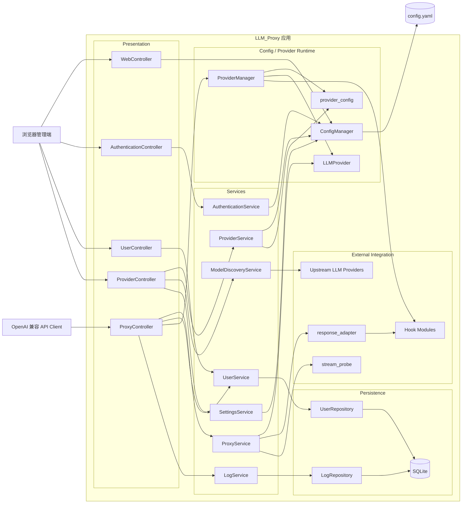
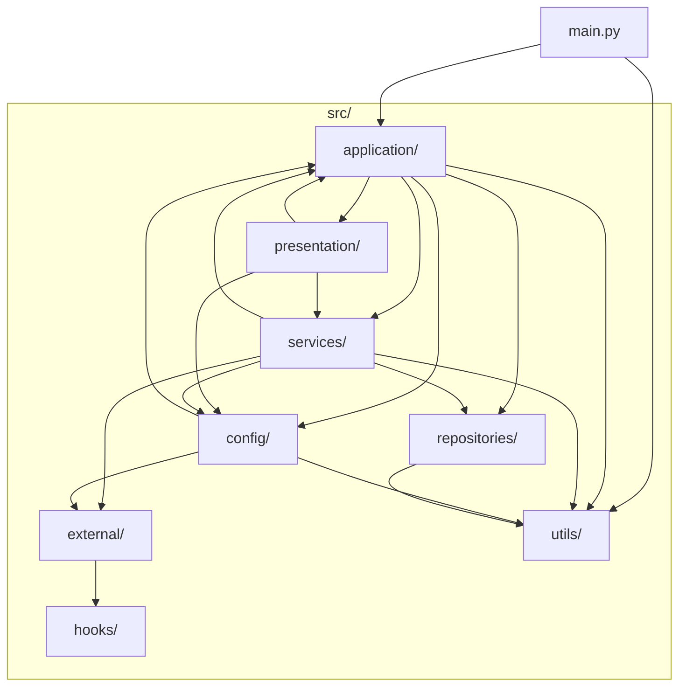
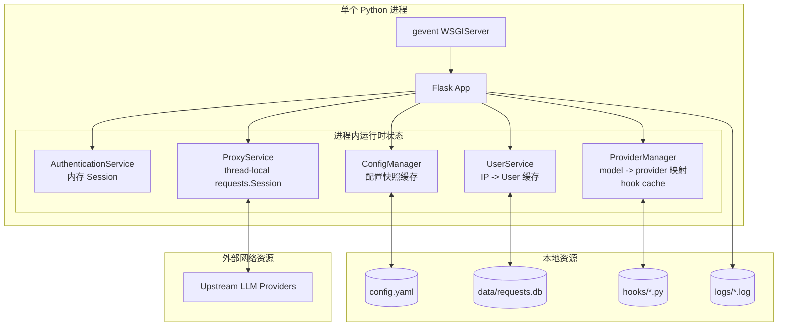
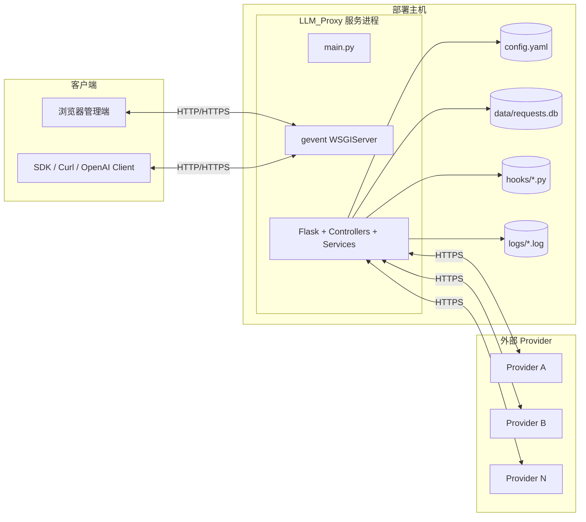
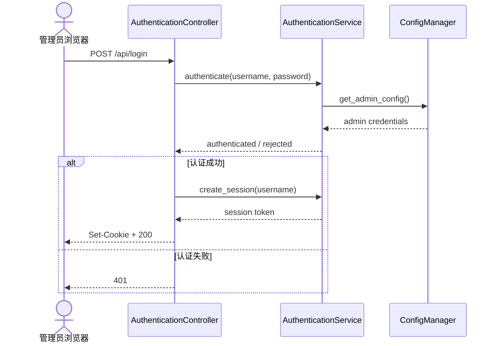
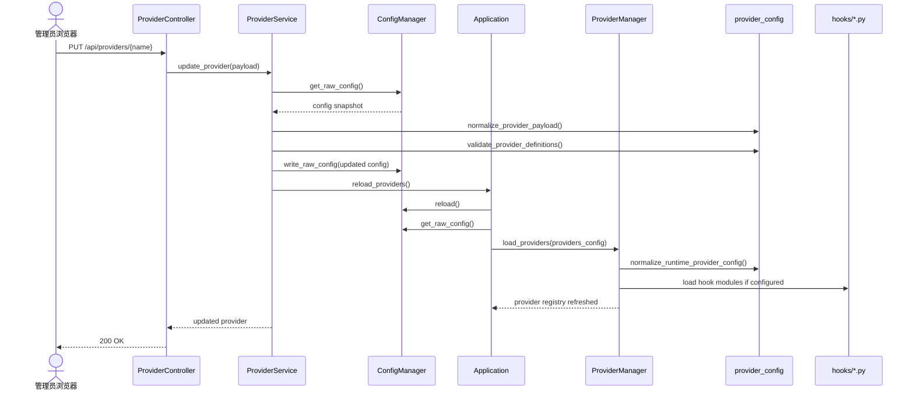
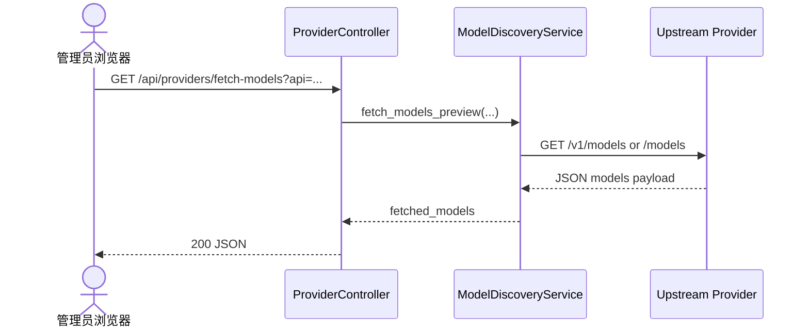
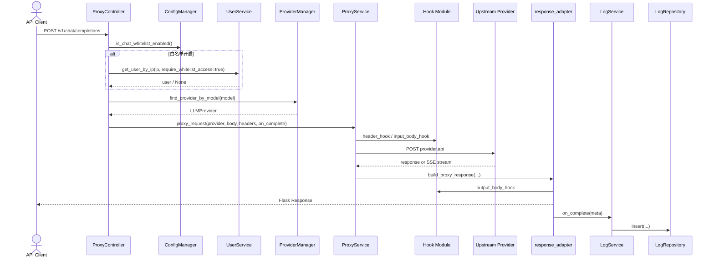

# LLM_Proxy 4+1 Architecture View

本文档描述当前代码实现对应的 4+1 架构视图，作为后续重构、评审和需求变更时的基线。

维护约束：
- 涉及模块职责、依赖关系、主请求链路、运行时状态、配置加载/重载机制、Hook 机制、部署拓扑的修改时，需要同步更新本文件。
- 如果代码实现与本图不一致，以代码为准，但提交中应补齐文档更新。

## 0. 架构摘要

系统当前是一个单进程、分层式单体应用，按职责分成两条主轴：
- 控制平面：后台管理、认证、用户、Provider 配置、系统设置。
- 数据平面：OpenAI 兼容代理、模型路由、上游请求转发、响应适配、日志落库。

关键代码位置：
- 启动与装配：[main.py](/d:/001Code/008llm/003LLM_Proxy/main.py)
- 组合根：[application.py](/d:/001Code/008llm/003LLM_Proxy/src/application/application.py)
- 配置与 Provider 运行时：[config_manager.py](/d:/001Code/008llm/003LLM_Proxy/src/config/config_manager.py) [provider_manager.py](/d:/001Code/008llm/003LLM_Proxy/src/config/provider_manager.py)
- 代理主链路：[proxy_controller.py](/d:/001Code/008llm/003LLM_Proxy/src/presentation/proxy_controller.py) [proxy_service.py](/d:/001Code/008llm/003LLM_Proxy/src/services/proxy_service.py)

## 1. Logical View

逻辑划分：
- `Presentation` 负责 HTTP 路由、鉴权入口、页面渲染和请求/响应封装。
- `Services` 负责用例编排，不直接持有全局可变配置。
- `Config / Provider Runtime` 负责 YAML 配置快照、Provider 规范化、模型到 Provider 的运行时映射。
- `Persistence` 负责 SQLite 读写。
- `External Integration` 负责上游协议适配、流式探测、Hook 扩展和上游 Provider 集成。

## 2. Development View

开发视图解读：
- `application` 是组合根，不承载具体业务规则。
- `presentation -> services` 是主要调用方向。
- `services -> repositories/config/external` 是业务侧依赖方向。
- `config` 既不是传统 repository，也不是 service，更像运行时配置与 Provider 注册子系统。

## 3. Process View

进程视图要点：
- 当前是单进程单实例内存态设计。
- `AuthenticationService` 的 Session 存在进程内存中，重启后失效。
- `UserService` 有 IP 维度缓存。
- `ProviderManager` 持有运行时模型路由表和 Hook 缓存。
- `ProxyService` 维护 thread-local `requests.Session`。
- 如果未来引入多实例部署，这些内存态要重新设计。

## 4. Physical View

物理视图要点：
- 部署结构目前非常简单，单机即可运行。
- 本地状态包括配置文件、SQLite、日志文件、Hook 文件。
- 外部依赖主要是上游模型 Provider 的 HTTP API。

## 5. Scenario View

### 5.1 管理员登录

### 5.2 Provider 配置变更并自动重载

### 5.3 后台探测上游模型列表

### 5.4 代理一次 `/v1/chat/completions`

## 6. 当前架构判断

当前架构优点：
- 模块划分清楚，学习成本低。
- 单进程单文件配置的运维复杂度很低。
- 控制平面和数据平面在职责上已经开始分离。
- Hook 扩展点足够轻量，适合小规模快速演进。

当前架构边界：
- 运行时状态仍集中在单进程内存中，不适合多实例横向扩展。
- `presentation` 层仍承担部分接口协议细节和错误映射责任。
- `config` 子系统目前同时承担配置快照、配置规范化、Provider 注册三类职责。
- Hook 是运行时动态加载，扩展灵活，但也引入了热更新和可观测性上的复杂性。

## 7. 后续演进建议

如果后面继续演进，优先级建议是：
- 把 `provider_config` 进一步收敛成显式 schema / factory。
- 为 `ProviderManager` 增加更清晰的只读运行时接口。
- 评估是否把 Session、Provider Registry、User IP 缓存从单进程内存态解耦。
- 补一份 ADR，说明为什么当前仍选择单体 + 单进程 + SQLite。
