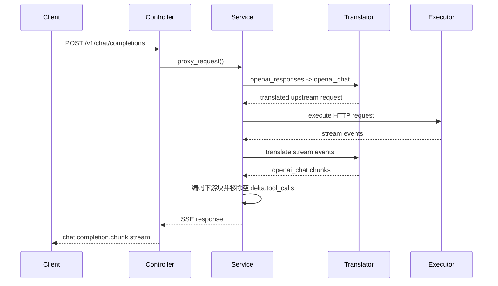
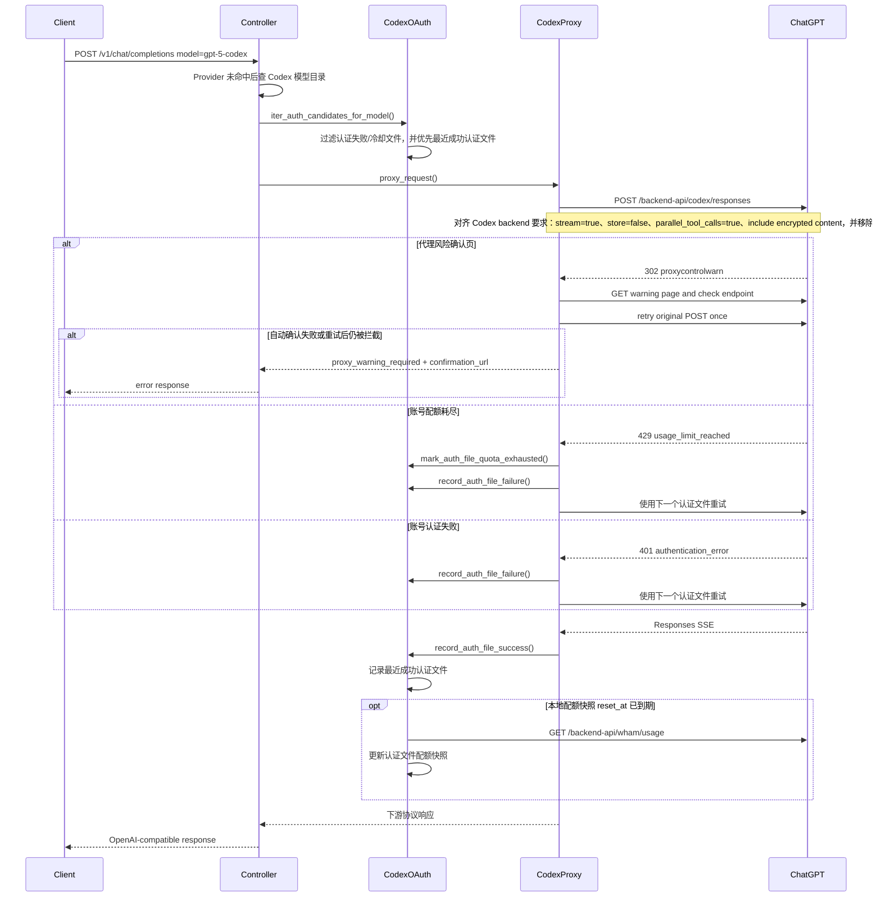
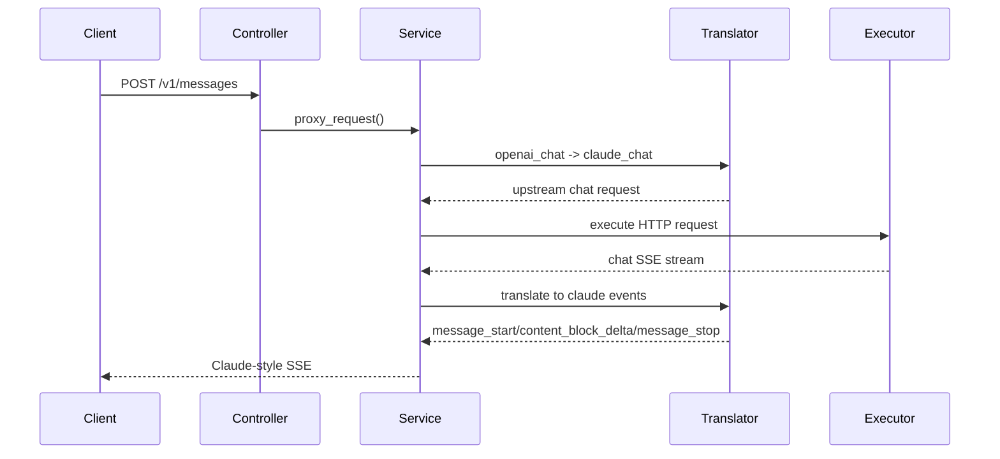

# 4+1 Architecture

## 1. Context

这个项目是一个协议翻译型 LLM Proxy。

它的目标不是“支持所有厂商的所有接口”，而是用一套干净的首版架构，稳定支持：

- 上游协议族
  - `openai_chat`
  - `openai_responses`
  - `claude_chat`
- 下游协议面
  - `POST /v1/chat/completions`
  - `POST /v1/responses`
  - `POST /v1/messages`
  - `GET /v1/models`
  - `OPTIONS /v1/*` CORS 预检

这个版本不保留 Gemini / Antigravity。配置加载阶段会清理少量历史废弃字段并回写配置文件；除此之外不再继续扩展旧字段兼容逻辑。

控制平面除了 Provider、Auth Group、用户、统计和系统设置，还可以在启用 `oauth.enabled` 后提供 OAuth 管理入口，用于生成和查看 CLI/OAuth 类本地认证文件。

## 2. Logical View

### 2.1 Core Pipeline

系统按下面的统一链路工作：

```text
downstream request
  -> data-plane CORS preflight / response headers
  -> controller
  -> provider lookup
  -> header_hook / request_guard
  -> translator.translate_request()
  -> executor
  -> decoder
  -> translator.translate_response()
  -> response_guard
  -> encoder
  -> downstream response
```

补充：hook 在 retry 场景下还可以读取上一轮失败摘要，用于做轻量级重试决策：

- `last_status_code`
- `last_error_type`

### 2.2 Major Components

- `ProxyController`
  - 根据当前 route family 选择下游接口协议
  - 构造标准错误体
- `DataPlaneCors`
  - 只为 `/v1/*` 数据平面添加 CORS 响应头
  - 直接处理 `OPTIONS /v1/*` 预检请求
- `WebController`
  - 提供 Provider、用户、统计与系统设置页面
  - 在 `oauth.enabled=true` 时显示 OAuth 顶层导航入口
  - 暴露系统设置读取与保存接口
- `OAuthController`
  - 暴露 Codex / Claude OAuth 登录、回调提交、认证文件列表、删除与 Codex 配额刷新接口
- `CodexOAuthService`
  - 生成 Codex OAuth PKCE 授权链接
  - 使用回调 URL 换取 token 并写入本地认证文件
  - 删除本地认证文件时同步清理该文件的本地状态
  - 读取认证文件状态，并按需刷新 token 后查询 Codex 配额
  - token 交换、token 刷新与配额查询遇到代理风险确认页时，会走统一自动确认重试流程
  - 按认证文件名限制同一时刻只有一个配额刷新请求会真实访问上游
  - 持久化认证文件最近一次配额快照、配额刷新错误、最近成功认证文件与 Codex 模型代理使用状态
  - 维护本地手动 Codex OAuth 模型目录
  - 按本地模型目录、本地冷却、认证失败状态和最近成功认证文件提供 Codex 请求候选账号
- `ClaudeOAuthService`
  - 生成 Claude OAuth PKCE 授权链接
  - 使用回调 URL 或手动粘贴的 `code#state` 换取 token 并写入本地认证文件
  - 列出和删除 `data/oauth/claude/*.json`
  - 维护本地手动 Claude OAuth 模型目录
  - 按本地模型目录、认证失败状态和最近成功认证文件提供 Claude 请求候选账号
  - token 交换与 token 刷新遇到代理风险确认页时，会走统一自动确认重试流程
- `CodexProxyService`
  - 代理下游直接使用的 Codex 普通模型名
  - 使用 `data/oauth/codex/*.json` 中的 OAuth access token 请求 Codex backend
  - 遇到账号配额耗尽时标记临时冷却并尝试下一个账号
  - 将每个认证文件最近一次数据面成功或失败结果写回 OAuth 状态
- `ClaudeProxyService`
  - 代理下游直接使用的 Claude 普通模型名
  - 使用 `data/oauth/claude/*.json` 中的 OAuth access token 请求 Anthropic Messages
  - 按 CPA / CLIProxyAPI 请求方式补齐 Claude Code OAuth headers，并在存在 billing header 时重签 `cch`
  - 将每个认证文件最近一次数据面成功或失败结果写回 OAuth 状态
- `ProviderManager`
  - 加载 provider 配置
  - 维护 `provider/model -> provider` 映射
- `AuthGroupManager`
  - 加载 `auth_groups`
  - 选择 `auth_entry`
  - 持久化冷却、禁用与配额运行态
- `ProxyService`
  - 组装整条代理链路
  - 根据当前请求所处接口选择 translator 和 encoder
  - 对 `source_format=claude_chat` 的 Provider，在上游 body 已有 Claude Code billing header 时重签 `cch`
  - 在开启 `logging.llm_request_debug_enabled` 时输出独立 trace
- `ProviderModelTestService`
  - 复用 translator / executor / request-side hook
  - 按当前 Provider 表单快照直连上游测试模型可用性、首字延迟与 TPS
  - 在协议支持时显式请求 usage 返回
  - 批量测试按前端当前选择的模型行逐条执行并逐条回填结果
- `SettingsService`
  - 维护 `server`、`admin`、`oauth` 与 `logging`
  - 管理立即生效项与重启生效项的边界
- `ProviderRuntimeFactory`
  - 负责临时 / 正式 Provider 运行时对象构建
  - 统一 hook 加载与缓存
- `ExecutorRegistry`
  - 负责 HTTP 上游连接
  - 统一处理 Provider 出站请求中的代理风险确认页自动确认与一次重试
- `Decoder`
  - 将上游流拆成统一事件
- `TranslatorRegistry`
  - 负责协议适配
- `Encoder`
  - 将统一 chunk 编码成下游协议
- `Hook`
  - 只负责 header 和 guard

Hook 组件除了 header / guard，还会收到最小重试上下文：

- `retry`
- `auth_group_name`
- `auth_entry_id`
- `last_status_code`
- `last_error_type`

### 2.3 Protocol Families

| family | 用途 |
| --- | --- |
| `openai_chat` | OpenAI Chat Completions 语义 |
| `openai_responses` | OpenAI Responses 语义 |
| `claude_chat` | Anthropic Messages 语义 |

OpenAI Chat SSE 下游编码会移除空的 `choices[].delta.tool_calls`，避免兼容客户端把空列表误判为工具调用开始；非空工具调用保持原样。

## 3. Process View

### 3.1 Downstream Route Contract

route family 直接决定当前请求的下游接口协议：

| route | downstream protocol |
| --- | --- |
| `/v1/chat/completions` | `openai_chat` |
| `/v1/responses` | `openai_responses` |
| `/v1/messages` | `claude_chat` |

`GET /v1/models` 除了模型 id，还会返回模型所属 provider 的：

- `source_format`

OAuth 模型是数据平面的例外路由：

- Provider 配置模型仍使用 `{provider}/{model}` key
- Codex / Claude OAuth 模型使用原始模型名，例如 `gpt-5-codex`、`claude-sonnet-4-5`
- `ProxyController` 先查 Provider 映射，未命中时再查 Codex OAuth 模型目录，最后查 Claude OAuth 模型目录
- `/v1/models` 对 Codex OAuth 暴露普通模型名，`provider_name` 固定为 `codex`
- `/v1/models` 对 Claude OAuth 暴露普通模型名，`provider_name` 固定为 `claude`
- Codex OAuth 代理复用 translator registry，把下游 `openai_chat` / `openai_responses` / `claude_chat` 转成 Codex backend 的 Responses 请求
- Claude OAuth 代理复用 translator registry，把下游 `openai_chat` / `openai_responses` / `claude_chat` 转成 Anthropic Messages 请求

`OPTIONS /v1/*` 由表现层 CORS 钩子直接返回 `204`，用于支持浏览器、Obsidian 插件等第三方应用的跨域预检，不进入 provider lookup、白名单校验或上游代理链路。实际 `/v1/*` 响应也会附加 CORS 响应头；后台 `/api/*` 和管理页面不开放跨域。

### 3.2 Control-Plane Settings Contract

系统设置页与配置接口：

- 页面
  - `GET /settings`
- API
  - `GET /api/settings/system`
  - `PUT /api/settings/system/basic`
  - `PUT /api/settings/system/oauth`
  - `PUT /api/settings/system/debug`
  - `PUT /api/settings/system`

当前支持的配置项：

- `server.host`
- `server.port`
- `admin.username`
- `admin.password`
- `logging.path`
- `logging.level`
- `logging.llm_request_debug_enabled`
- `oauth.enabled`
- `oauth.proxy_mode`
- `oauth.proxy`
- `oauth.verify_ssl`

行为约束：

- `server.*` / `admin.*`
  - 归类为“基础设置”
  - 需要显式点击保存后提交
- `server.host` / `server.port`
  - 保存时写回配置文件
  - 如果值发生变化，需要重启服务后生效
- `admin.username` / `admin.password`
  - 两者都非空时启用后台登录
  - 任一为空时关闭后台登录
  - 保存后会清空进程内 session，避免旧凭据继续生效
- `logging.*`
  - 归类为“Debug”
  - 页面修改后自动生效
- `logging.path` / `logging.level`
  - 保存后会重新装配 logger
  - 新请求会按新的日志路径和日志级别输出
- `logging.llm_request_debug_enabled`
  - 打开后写入独立 trace 日志
  - 记录四个阶段：
    - 下游请求
    - 转换后的上游请求
    - 上游响应
    - 转换后的下游响应
  - 每条记录包含起始行、header 与 payload
- `oauth.enabled`
  - 保存后立即影响管理后台顶部 OAuth 页签是否显示
  - 默认值为 `false`
  - 只有开启后，系统设置页才展示 OAuth 代理服务和 SSL 校验设置
- `oauth.proxy_mode`
  - 保存后立即影响 OAuth 控制平面请求和 OAuth 数据面代理
  - 支持 `direct` / `system` / `custom`
  - `direct` 会绕开进程环境代理，`system` 会使用进程环境代理，`custom` 会读取 `oauth.proxy`
- `oauth.proxy`
  - 保存后立即影响 OAuth 控制平面请求
  - 用于 Codex / Claude OAuth token 交换、token 刷新、Codex 配额查询与 OAuth 数据面代理
  - 仅在 `oauth.proxy_mode=custom` 时生效
  - 自定义代理 URL 中 userinfo 的账号密码会在保存时规范化转义
- `oauth.verify_ssl`
  - 保存后立即影响 OAuth 控制平面请求和 OAuth 数据面代理
  - 默认值为 `false`
  - 关闭时不校验 HTTPS 证书，便于本地代理或抓包代理场景

运行时内存状态补充：

- `Application`
  - 在保存日志配置后可重新装配 logger handler
- `WebController`
  - 渲染后台页面时读取当前 `oauth.enabled`，用于决定是否输出 OAuth 顶层导航项
- `CodexOAuthService`
  - 每次 token / quota / models 请求读取当前 `oauth.proxy_mode`、`oauth.proxy` 与 `oauth.verify_ssl`
  - 维护 OAuth PKCE 临时会话、Codex 账号配额冷却状态与认证文件配额刷新锁
  - 在 `data/oauth/codex/.state/auth_files.json` 持久化认证文件配额、最近一次模型代理状态与最近成功认证文件
- `ClaudeOAuthService`
  - 每次 token / models 请求读取当前 `oauth.proxy_mode`、`oauth.proxy` 与 `oauth.verify_ssl`
  - 维护 OAuth PKCE 临时会话
  - 认证文件保存在 `data/oauth/claude/`
  - 在 `data/oauth/claude/.state/auth_files.json` 持久化最近一次模型代理状态与最近成功认证文件
- `CodexProxyService`
  - 每次 Codex 数据面请求读取当前 `oauth.proxy_mode`、`oauth.proxy` 与 `oauth.verify_ssl`
- `ClaudeProxyService`
  - 每次 Claude 数据面请求读取当前 `oauth.proxy_mode`、`oauth.proxy` 与 `oauth.verify_ssl`

### 3.3 Provider Runtime Contract

Provider 公共配置字段只有：

- `name`
- `api`
- `source_format`
- `api_key`
- `auth_group`
- `proxy_mode`
- `proxy`
- `timeout_seconds`
- `max_retries`
- `verify_ssl`
- `model_list`
- `hook`

其中：

- `source_format`
  - 上游真实协议
- `proxy_mode`
  - 支持 `direct` / `system` / `custom`
  - `direct` 明确绕开环境代理，`system` 使用进程环境代理，`custom` 使用 `proxy`
- `proxy`
  - 仅在 `proxy_mode=custom` 时生效
  - 自定义代理 URL 中 userinfo 的账号密码会在保存时规范化转义

历史配置载入时会自动删除 `target_format`、`target_formats` 和 `transport` 并回写配置文件，用于兼容迁移窗口内的旧配置。
历史 Provider / OAuth 配置缺少 `proxy_mode` 时也会在载入阶段自动回写：有 `proxy` 的配置补为 `custom`，没有 `proxy` 的配置补为 `direct`。

没有公共 `transport` 或 `stream_format` 字段；Provider 上游传输固定由 HTTP executor 处理。

Hook 运行时上下文还会暴露最小重试状态：

- `retry`
- `auth_group_name`
- `auth_entry_id`
- `last_status_code`
- `last_error_type`

其中 `last_error_type` 使用 `HookErrorType` 枚举，当前值为：

- `TIMEOUT`
- `CONNECTION_ERROR`
- `TRANSPORT_ERROR`

### 3.4 Internal Stream Detection

流式识别完全是内部实现细节：

- HTTP `Content-Type = text/event-stream`
  - 按 SSE JSON 处理
- HTTP `Content-Type` 含 `ndjson/jsonl`
  - 按 NDJSON 处理
- 其他
  - 按非流式处理
- 如果请求声明为流式，但首块看起来像 SSE
  - 触发首块探测兜底

这层能力保留在 executor / decoder 中，不暴露给用户配置。

### 3.5 Runtime Trace Logging

当 `logging.llm_request_debug_enabled = true` 时：

- 应用会写入 `logs/llm_request_trace.log`
- 与 `app.log`、`access.log` 分离
- 采用相同的滚动策略：
  - `RotatingFileHandler`
  - `maxBytes = 10 MiB`
  - `backupCount = 3`

### 3.6 Control-Plane Model Fetching And Testing

Provider 编辑页包含两条控制平面上游探测链路：

- `GET /api/providers/fetch-models`
- `POST /api/providers/test-models`

链路如下：

```text
provider editor form snapshot
  -> controller
  -> auth header resolve (api_key or auth_group + auth_entry)
  -> ProviderRuntimeFactory
  -> request_guard / header_hook
  -> translator.translate_request()
  -> usage request enrichment when protocol supports it
  -> executor
  -> decoder
  -> translator.translate_response(openai_chat benchmark view)
  -> metric collector
  -> modal result table
```

模型拉取链路如下：

```text
provider editor form snapshot
  -> controller
  -> auth header resolve (api_key or auth_group + auth_entry)
  -> model endpoint inference
  -> upstream fetch (/v1/models or /models)
  -> fetched model picker
  -> provider form model table
```

行为约束：

- 这两条都是控制平面能力，不经过下游 `/v1/chat/completions` / `/v1/responses` / `/v1/messages`
- 两条链路都会使用 Provider 表单快照中的 `proxy_mode`、`proxy` 和 `verify_ssl`
- Provider 编辑页的 `model_list` 采用表格编辑，并以当前前端行状态作为唯一数据源
- 只应用 request-side hook：
  - `header_hook`
  - `request_guard`
- 不应用 `response_guard`
- `auth_group` 模式下：
  - 拉取模型必须显式选择 `auth_entry`
  - 测试模型也必须显式选择 `auth_entry`
  - 两者都不经过 `AuthGroupManager.acquire()`
  - 两者都不写运行态冷却、并发、配额
- 首字延迟仅在真实流式首个正文或推理增量到达时记录
- TPS 仅在拿到 completion usage 后计算
- 如果上游成功但未返回 usage：
  - `available = true`
  - `tps = null`
- 批量测试会先锁定本次选中的目标行，再按顺序逐条请求
- 每一条测试结果一返回就立即回填到对应表格行
- 批量测试属于当前页面会话内行为；页面刷新或离开后，尚未开始的后续测试不会继续执行

补充说明：

- 数据平面主代理链路未变化
- 新增的是 Provider 编辑页上的控制平面上游模型拉取与性能测试链路

### 3.7 Control-Plane OAuth Management

OAuth 管理页在 `oauth.enabled=true` 时提供顶层 `OAuth` 导航项，并在页面内提供 `Codex` 与 `Claude` 子 tab。`oauth.enabled` 默认关闭，因此新配置默认不会展示 OAuth 页签。

页面与 API：

- 页面
  - `GET /oauth`
- API
  - `POST /api/oauth/codex/session`
  - `POST /api/oauth/codex/callback`
  - `GET /api/oauth/codex/models`
  - `POST /api/oauth/codex/models`
  - `DELETE /api/oauth/codex/models/<model_id>`
  - `GET /api/oauth/codex/auth-files`
  - `DELETE /api/oauth/codex/auth-files/<name>`
  - `GET /api/oauth/codex/auth-files/<name>/quota`
  - `POST /api/oauth/claude/session`
  - `POST /api/oauth/claude/callback`
  - `GET /api/oauth/claude/models`
  - `POST /api/oauth/claude/models`
  - `DELETE /api/oauth/claude/models/<model_id>`
  - `GET /api/oauth/claude/auth-files`
  - `DELETE /api/oauth/claude/auth-files/<name>`

Codex OAuth 登录链路如下：

```text
OAuth Codex tab
  -> create session
  -> generate PKCE verifier / challenge and state
  -> return auth.openai.com authorization URL
  -> user opens URL and signs in
  -> user pastes full callback URL
  -> token exchange
  -> write data/oauth/codex/*.json
  -> list / manage local Codex model IDs
  -> list auth file token/status/quota snapshot
  -> optional quota refresh to chatgpt.com/backend-api/wham/usage
  -> skip duplicate quota refresh when the same auth file is already refreshing
  -> persist quota snapshot or quota error
```

Claude OAuth 登录链路如下：

```text
OAuth Claude tab
  -> create session
  -> generate PKCE verifier / challenge and state
  -> return claude.ai authorization URL
  -> user opens URL and signs in
  -> user pastes full callback URL or code#state
  -> token exchange
  -> write data/oauth/claude/*.json
  -> list / manage local Claude model IDs
  -> list auth file token status
```

运行时与存储约束：

- OAuth state、PKCE verifier 只保存在进程内内存中
- 临时 OAuth 会话 TTL 为 10 分钟
- 认证文件保存在 `data/oauth/codex/`
- Claude 认证文件保存在 `data/oauth/claude/`
- Codex 认证文件名沿用 CLIProxyAPI 规则：普通账号为 `codex-{email}-{plan}.json`，team 账号为 `codex-{account_id_sha256前8位}-{email}-team.json`
- Claude 认证文件名沿用 CLIProxyAPI 规则：`claude-{email}.json`
- Codex 模型目录缓存在 `data/oauth/codex/models.json`，文件内容只保存模型 ID 字符串数组
- Claude 模型目录缓存在 `data/oauth/claude/models.json`，文件内容只保存模型 ID 字符串数组
- 认证文件的最近配额、配额错误、数据面使用状态和最近成功认证文件保存在 `data/oauth/codex/.state/auth_files.json`
- Claude 认证文件最近一次数据面使用状态和最近成功认证文件保存在 `data/oauth/claude/.state/auth_files.json`
- 认证文件列表会把候选筛选结果和触发原因作为状态显示；最近一次数据面错误摘要单独作为信息显示
- OAuth 页面认证文件列表按名称排序、每页最多展示 50 个，支持全选后批量刷新额度和批量删除
- OAuth 页面删除认证文件前会用气泡确认，确认后调用删除 API
- Codex 模型 ID 由用户在 OAuth 页面手动维护，默认列表为空
- Claude 模型 ID 由用户在 OAuth 页面手动维护，默认列表为空
- OAuth 页面提供 `router-for-me/models` 仓库的 `models.json` 与 `https://models.router-for.me/models.json` 作为外部参考链接，不自动拉取
- Codex 查询配额时如果认证文件 access token 已过期，且存在 refresh token，会先刷新认证文件
- Claude OAuth 数据面请求前如果认证文件 access token 已过期，且存在 refresh token，会先刷新认证文件
- Codex / Claude 候选列表仍会按请求重建；默认按认证文件修改时间倒序排列，但最近一次真实请求成功的认证文件如果未被过滤，会被提升为第一候选
- 同一个认证文件的配额刷新使用进程内非阻塞锁；重复刷新请求会直接返回跳过结果，不重复访问 Codex 上游
- 如果认证文件 access token 已过期且缺少 refresh token，请求候选筛选不会直接跳过；系统会先用当前 access token 尝试请求一次，再按上游返回的认证、配额或其他错误决定后续状态
- 配额刷新会同步内存冷却状态：Codex 窗口耗尽时冷却该认证文件，恢复可用时立即清除冷却
- Codex 数据面请求成功后，如果本地配额快照中的 Codex 窗口重置时间已经到期，会最佳努力刷新该认证文件的前端配额快照；刷新失败不会阻断本次模型响应
- 认证类错误会持久显示为认证失败并参与候选过滤；重新 OAuth 登录、token 刷新成功或后续真实请求成功后会清除该状态
- OAuth 顶层导航项是否显示由系统设置中的 `oauth.enabled` 控制
- token 交换、token 刷新、Codex 配额查询与 OAuth 数据面代理会使用系统设置中的 `oauth.proxy_mode`、`oauth.proxy` 和 `oauth.verify_ssl`
- Codex 数据面请求在上游返回错误或请求失败时，会记录当前认证文件信息并尝试下一个候选认证文件，直到成功或候选耗尽
- Claude OAuth 数据面请求会在转发 Anthropic Messages 前按 CPA 请求方式重签已有 Claude Code billing header 的 `cch`
- 普通 Provider 如果 `source_format=claude_chat`，也会在上游 body 已有 Claude Code billing header 时重签 `cch`；不会主动生成 billing header
- Claude 数据面请求在上游返回错误或请求失败时，会记录当前认证文件信息并尝试下一个候选认证文件，直到成功或候选耗尽
- 出站 HTTP 请求遇到代理风险确认页时，会自动确认一次并重试原请求；自动确认失败或重试后仍被拦截时，返回 `proxy_warning_required` 和确认页 URL
- Codex / Claude 上游返回 401 或认证类错误时，会将当前认证文件标记为认证失败，后续请求优先跳过
- OAuth 登录、文件、配额与模型目录管理属于控制平面
- Codex / Claude 模型代理属于 `/v1/*` 数据平面，但不进入 Provider 路由或 Auth Group 选择流程

## 4. Development View

### 4.1 Directory Responsibilities

- `src/presentation/`
  - HTTP route、管理页面、API controller
- `src/services/`
  - 代理主流程和业务服务
- `src/config/`
  - 配置加载、schema、provider runtime
- `src/executors/`
  - HTTP executor
- `src/proxy_core/`
  - decoder、encoder、shared contracts
- `src/translators/`
  - protocol translators
- `src/hooks/`
  - hook contracts

### 4.2 Key Files

- [src/services/proxy_service.py](/root/.ww/code/002llm/000LLM_Proxy/src/services/proxy_service.py)
  - 主代理 orchestration
- [src/services/settings_service.py](/root/.ww/code/002llm/000LLM_Proxy/src/services/settings_service.py)
  - 系统设置保存与生效边界
- [src/services/codex_oauth_service.py](/root/.ww/code/002llm/000LLM_Proxy/src/services/codex_oauth_service.py)
  - Codex OAuth PKCE、token 文件、本地模型 ID 目录与配额查询
- [src/services/claude_oauth_service.py](/root/.ww/code/002llm/000LLM_Proxy/src/services/claude_oauth_service.py)
  - Claude OAuth PKCE、token 文件、本地模型 ID 目录与认证文件管理
- [src/services/codex_proxy_service.py](/root/.ww/code/002llm/000LLM_Proxy/src/services/codex_proxy_service.py)
  - Codex OAuth 数据面代理与账号配额切换
- [src/services/claude_proxy_service.py](/root/.ww/code/002llm/000LLM_Proxy/src/services/claude_proxy_service.py)
  - Claude OAuth 数据面代理与账号切换
- [src/presentation/oauth_controller.py](/root/.ww/code/002llm/000LLM_Proxy/src/presentation/oauth_controller.py)
  - OAuth 管理 API
- [src/config/provider_config.py](/root/.ww/code/002llm/000LLM_Proxy/src/config/provider_config.py)
  - Provider schema
- [src/executors/registry.py](/root/.ww/code/002llm/000LLM_Proxy/src/executors/registry.py)
  - HTTP executor
- [src/proxy_core/decoders.py](/root/.ww/code/002llm/000LLM_Proxy/src/proxy_core/decoders.py)
  - 流式解码
- [src/proxy_core/encoder.py](/root/.ww/code/002llm/000LLM_Proxy/src/proxy_core/encoder.py)
  - 下游编码
- [src/translators/registry.py](/root/.ww/code/002llm/000LLM_Proxy/src/translators/registry.py)
  - 4x4 translator registry
- [src/presentation/templates/providers.html](/root/.ww/code/002llm/000LLM_Proxy/src/presentation/templates/providers.html)
  - Provider 页面与 `source_format` / Auth Group 编辑
- [src/presentation/templates/settings.html](/root/.ww/code/002llm/000LLM_Proxy/src/presentation/templates/settings.html)
  - 系统设置页面与帮助说明
- [src/presentation/templates/oauth.html](/root/.ww/code/002llm/000LLM_Proxy/src/presentation/templates/oauth.html)
  - OAuth 管理页面与 Codex / Claude 子 tab

## 5. Physical View

部署上是单体服务：

- 一个 Flask 应用
- 一个配置文件
- 一组滚动日志文件
- 一组本地 OAuth 认证文件
- 一组本地 OAuth 模型目录缓存
- 多个 provider 指向多个真实上游
- 下游统一接入这个代理

```text
Client / Agent / IDE
        |
        v
    LLM Proxy
        |
        +--> OpenAI Chat upstream
        +--> OpenAI Responses upstream
        +--> Claude Messages upstream
        +--> Codex upstream
        +--> auth.openai.com / chatgpt.com OAuth control-plane endpoints
        +--> claude.ai / api.anthropic.com OAuth control-plane endpoints
```

## 6. Scenarios

### 6.1 OpenAI Chat Downstream -> Responses Upstream



### 6.2 Plain Codex Model -> Codex OAuth Backend



### 6.2 Claude Downstream -> OpenAI Chat Upstream



## 7. Design Decisions

### 7.1 Why only four protocol families

因为项目当前的目标客户端只需要：

- OpenCode
- Codex
- Claude Code
- Cherry Studio

Gemini / Antigravity 这类协议面会显著增加配置复杂度，但对当前目标收益很低，因此本版直接移除。

### 7.2 Why no public `stream_format`

因为流格式判断应该是代理内部责任，而不是用户负担。

用户只需要清楚：

- 上游是什么协议
- 下游要暴露成什么协议集合

上游到底是 SSE、NDJSON 还是非流式，由 executor / decoder 自动判断。
